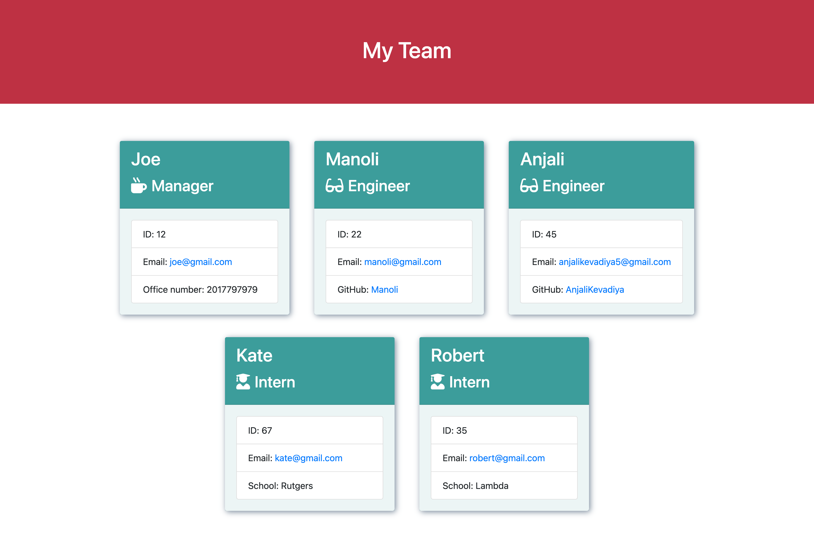

# Profile Generator

## Table of Contents

- [Description](#description)

- [Installation](#installation)

- [Tests](#tests)

- [Walkthrough video](#walkthrough-video)

- [Questions](#questions)

## Description

```
This application helps you to build a software engineering team generator command line application. The application will prompt the user for information about the team manager and then information about the team members. The user can input any number of team members, and they may be a mix of engineers and interns. When the user has completed building the team, the application will create an HTML file that displays a nicely formatted team roster based on the information provided by the user.
```

## Installation

To install necessary dependencies, run the following command:

```
npm i
OR
npm install
```

## Tests

To run tests, run the following command:

```
npm run test
```

## [Walkthrough video](https://youtu.be/7dKltA-CBg4)

---



---

## Questions

If you have any questions about the repo, open issue or contact me directly at [anjalikevadiya5@gmail.com](anjalikevadiya5@gmail.com). You can find more of my work at [AnjaliKevadiya](https://github.com/AnjaliKevadiya).
